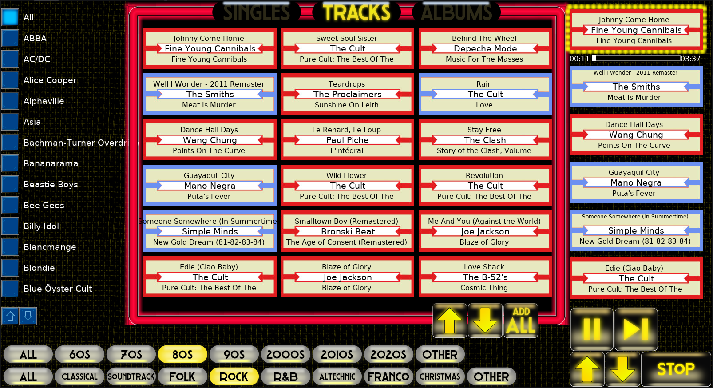
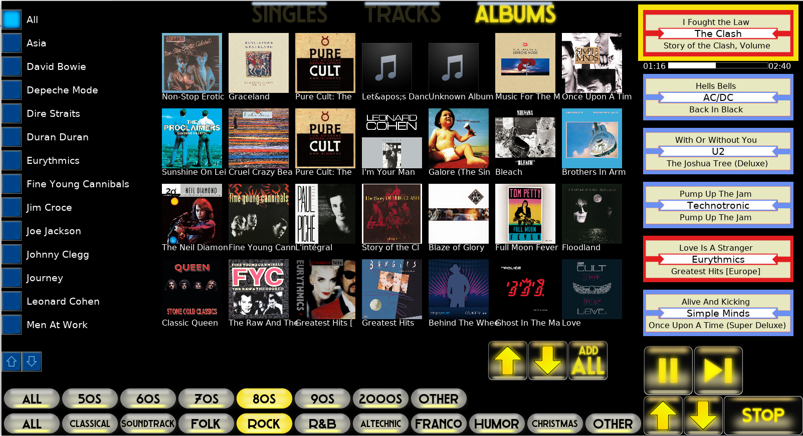
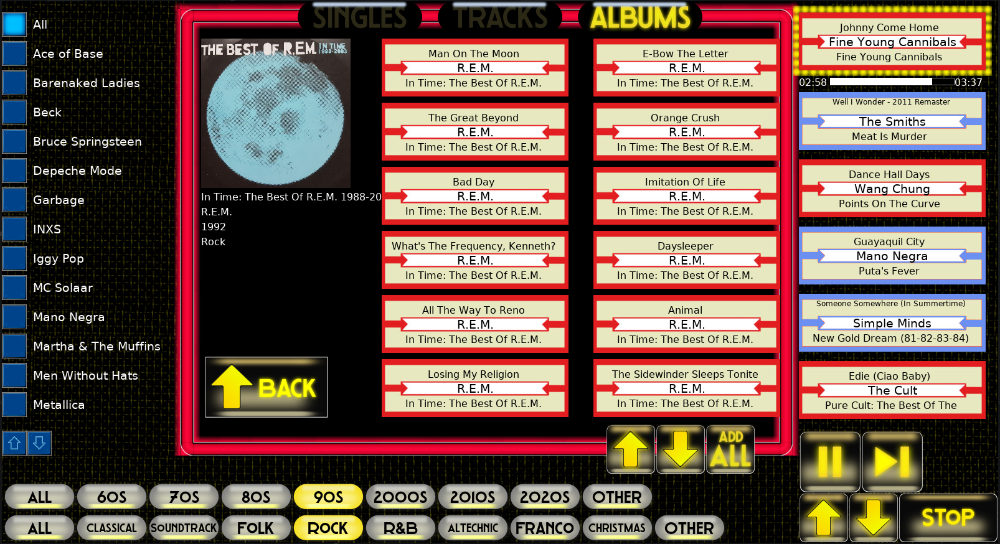
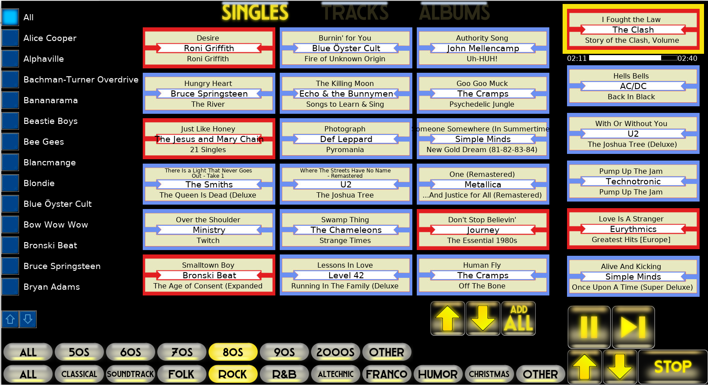
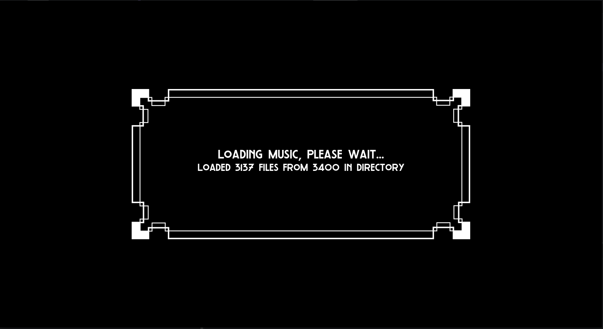

Deco Jukebox

This is a Python jukebox designed for a touch-screen interface. Just point it to your iTunes library and go! The top buttons changes the view between Singles / Tracks / Albums. The interface lets you sort by epochs, genres, and artists. The middle panel will contain a random selection of tracks, or show all the albums. In track view, add to the playlist by tapping a song label, or add all by tapping "add all".

Quick start:
1) Install Python (3.14 is current as of this writing) and the packages listed in requirements.txt. Windows: click-check "Add python.exe to PATH" during installation. install packages with "pip install whatever" on a command line, with whatever=pyglet, python-vlc, unidecode, mutagen, requests.
2) Install VLC. On Ubuntu do NOT use the snap install. Just "sudo apt install vlc". on Windows go to the official site: https://www.videolan.org/vlc/.
3) Clone this repo, unzip it if it's zipped.
4) In the repo files, edit the jukebox.cfg file. Change the "music_root_folder=" entry so it points to your music library.
5) Run it from the command line: "python3 jukebox.py" or "python.exe jukebox.py"

Your music library:
It should be organized like an iTunes library. That is, directory structure should be my_music/some_artist/some_album/some_songs.mp3. mp3's and m4a's will work. m4p's (which require DRM to play) will be ignored. The music is sorted from the music files metadata. The metadata can be a bit wonky, and that will cause trouble or confusion in navigating. For instance, Daft Punk could be tagged as 'french disco', which is a problem if you're expecting it to show up in 'electronica'.
To palliate this kind of problem, Deco Jukebox offers some features: custom genres, and genre assignments. Have a look at the "user_classifications" folder contents and the 'readme' in there. The second method consists in brute-forcing the metadata. A crude tool for this is "hard_remap_genres.py",
which is included in the project. One has to change the target directory path and de-comment the lines that change things and save the changes. I suggest using this on an album-to-album or artist-to-artist basis. Just don't put your library as the top path. Brute-forcing is not undoable.

Genres:
The 'genre' buttons are specified in "jukebox.cfg" (the "genres_list" item). I recommend not exceeding nine genres in the list. If you exceed this number, on the 1600x900 resolution you will start losing buttons. All of these genres can be custom genres, all you have to do is create a list of sub-genres and throw it in the user_classifications/genres/ folder. Any song that *matches* the genre or sub-genre therein will show up when that genre button is lit. See the readme in "user_classifications" for more details.

Album covers:
Once you've set your music library path, run 'discogs_album_cover_scraper.py' to retrieve at least some of the album art. The album art lives in graphics/album_covers/ and should be png format. File names need to match the album title as it is found in the music files metadata for that album (which can differ from the directory name). It is assumed all album titles are unique, and has not posed a problem for me except for 'Greatest Hits' which is all too common. Solution for that would be to force unique album titles in the metadata. I just let it ride.

Font:
The font that gives this jukebox its art-deco look is called 'Lavoir' and can be found here:
https://fontlibrary.org/en/font/lavoir
If this font is not installed (on Linux this means at root level), then the jukebox should default to one of the obvious fonts. But it won't look as cool.

Windows / Linux:
Deco Jukebox works in both. Note Windows and Linux paths use different slashes ("\" vs "/" respectively).

Raspberry pi:
Works on a Raspberry pi 5 running either Raspberry OS or Ubuntu. The only weird difference is that the album cover art png's MUST have with RGBA channels. The scraper does take care of that, but if you're supplementing the album cover art yourself, you have to add an alpha channel to the image or the jukebox will crash.

If you enjoy this project, consider buying me a coffee.

Patrick Dumais (patatorre "at" proton.me)

Step by step install on a Raspberry pi / pi OS / Ubuntu
--------------------------------------
1) Open a terminal window
2) clone the github repo: "git clone https://github.com/patatorre/deco_jukebox.git". If git's not there, "sudo apt update", "sudo apt install git"
3) Create a virtual environment. "cd deco_jukebox", "python3 -m venv venv". If python isn't installed go to python.org.
4) Install packages. "source venv/bin/activate", to get the virtual environment going, then "pip install -r requirements.txt".
5) Edit the .cfg file. "nano jukebox.cfg", then scroll down and change the line starting with music_root_folder=, put in your music folder, probably /home/admin/Music/. Ctrl-O to save, ctrl-X to exit
6) Install the font manager "sudo apt install font-manager"
7) Download the "Lavoir" font from: https://fontlibrary.org/en/font/lavoir (there'll be a lot of trash "download" buttons, the correct one is the brownish button top right)
8) Expand the font .zip and install the font: double-click "lavoir.otf" in the gui
9) Install vlc? "sudo apt install vlc". I actually didn't have to do this on my pi OS. 
10) Run jukebox "python3 jukebox.py". Note that you'll have to activate the virtual environment every time you want to run it. Figure out how to script it.

Step by step install on Windows
-------------------------------
1) Download the project .zip from https://github.com/patatorre/deco_jukebox and extract the files.
2) Install Python if you haven't got it already. Click-check "Add python.exe to PATH" during installation. Reboot.
3) Create a virtual environment: in a CMD window, navigate to the project folder, and "python -m venv venv"
4) Activate the virtual environment. Still in that CMD window, type "venv/Scripts/activate.bat"
5) Install the packages. Do "pip install XXX", where XXX is pyglet, python-vlc, unidecode, mutagen, requests, pillow. You can check the list in requests.txt, but for some reason the Pillow version listed didn't install under Windows 11 on my test machine. Whereas "pip install pillow" worked.
6) Install VLC (64 bits, apparently this needs to match whatever you're using for Python) from https://www.videolan.org/vlc/.
7) Add the VLC application directory to "path" in the environmental variables. Path is probably "C:\Program Files\videolan\vlc". Reboot. This is because python-vlc uses a dll in there.
8) Download and install the "Lavoir" font from: https://fontlibrary.org/en/font/lavoir (there'll be a lot of trash "download" buttons, the correct one is the brownish button top right).
9) Edit "jukebox.cfg", change the line starting with "music_root_folder=" and change the path that follows so it points to your music library, probably C:\Users\[yourname]\Music.
10) Now you're ready to run it. In a CMD window, activate the venv again (see 3) and then "python jukebox.py"

